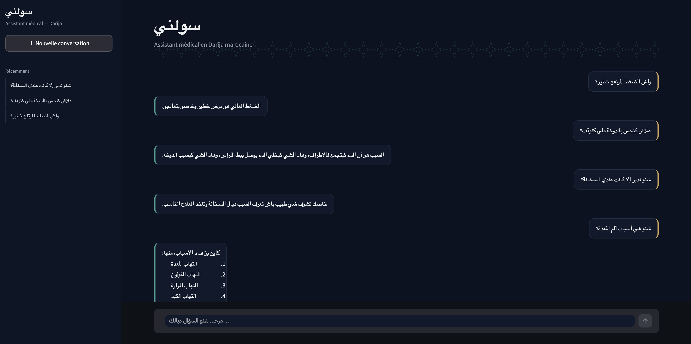

# Darija Medical QA

Projet académique de **Question Answering médical en Darija marocaine**.

Ce dépôt présente un système de génération automatique de réponses médicales en Darija marocaine à partir de questions formulées dans cette même variété linguistique.

## Objectifs du projet

Le projet vise à :

- analyser et préparer des données de Question Answering médical en Darija ;
- adapter plusieurs modèles Transformer à la tâche ;
- comparer différentes architectures et stratégies d’adaptation ;
- générer des réponses médicales en Darija marocaine ;
- évaluer les modèles avec des métriques lexicales et sémantiques ;
- proposer une interface simple pour tester le modèle retenu.

## Modèles étudiés

Les modèles suivants ont été comparés :

- **Atlas-Chat**
- **Llama 3.1**
- **Mistral 7B**
- **Phi-3.5 Mini**
- **AraBART**

Les modèles Decoder-only sont adaptés avec **Supervised Fine-Tuning (SFT) + QLoRA**, tandis qu’AraBART est adapté avec un **Fine-Tuning complet**.

## Méthodologie

Le protocole expérimental suit les principales étapes suivantes :

1. Analyse et nettoyage du corpus.
2. Découpage des données en ensembles d’entraînement, de validation et de test.
3. Tokenisation et formatage des entrées selon chaque modèle.
4. Adaptation des modèles.
5. Génération des réponses sur l’ensemble de test.
6. Évaluation des réponses générées.
7. Comparaison des performances des modèles.

## Configuration expérimentale

Principaux paramètres utilisés pour les modèles Decoder-only :

- LoRA rank : `16`
- LoRA alpha : `32`
- LoRA dropout : `0.05`
- Learning rate : `2e-4`
- Nombre d’époques : `1`
- Longueur maximale : `256` tokens
- Batch size par appareil : `4`
- Gradient accumulation : `4`
- Seed : `42`

Pour **AraBART** :

- Fine-Tuning complet
- Learning rate : `3e-5`
- Nombre d’époques : `3`
- Longueur maximale : `256` tokens

## Métriques d’évaluation

Les modèles sont évalués avec :

- **BERTScore F1**
- **chrF**
- **Accuracy@0.5**
- **ROUGE-L**
- **Score composite**

Le score composite est calculé avec la pondération suivante :

```text
35 % BERTScore F1
25 % chrF
25 % Accuracy@0.5
15 % ROUGE-L
```

## Résultats finaux

| Modèle | BERTScore F1 | chrF | Accuracy@0.5 | ROUGE-L | Score composite |
|---|---:|---:|---:|---:|---:|
| Atlas-Chat | 0.7501 | 0.2391 | 0.5300 | 0.0693 | 0.4652 |
| Llama 3 | 0.7307 | 0.2020 | 0.5100 | 0.0685 | 0.4440 |
| AraBART | 0.6457 | 0.1052 | 0.4300 | 0.0467 | 0.3668 |

Atlas-Chat obtient les meilleures performances parmi les modèles évalués dans la configuration expérimentale retenue.

## Démonstration du système

L’interface permet à l’utilisateur de saisir une question médicale en Darija marocaine et d’obtenir une réponse générée par le modèle retenu.

<p align="center">
  
</p>

## Structure du projet

```text
darija-medical-qa/
├── README.md
├── requirements.txt
├── notebooks/
├── data/
├── src/
├── app/
├── results/
├── figures/
│   └── demo.png
├── docs/
└── models/
```

## Installation

Clone le dépôt :

```bash
git clone https://github.com/TON_USERNAME/darija-medical-qa.git
cd darija-medical-qa
```

Créer un environnement virtuel :

```bash
python -m venv .venv
source .venv/bin/activate
```

Installer les dépendances :

```bash
pip install -r requirements.txt
```

## Lancer l’interface

```bash
streamlit run app/app.py
```

## Données et modèles

Les fichiers volumineux ne doivent pas être ajoutés directement au dépôt GitHub, notamment :

- checkpoints ;
- fichiers `.gguf` ;
- fichiers `.safetensors` ;
- modèles téléchargés ;
- gros fichiers de données ;
- clés API et tokens privés.

## Avertissement médical

Ce projet est réalisé dans un cadre académique et expérimental.

Les réponses générées ne remplacent pas l’avis, le diagnostic ou les recommandations d’un professionnel de santé.

## Auteur

**Zakariya BEN KASSI**

Projet de fin d’études — Intelligence Artificielle.
